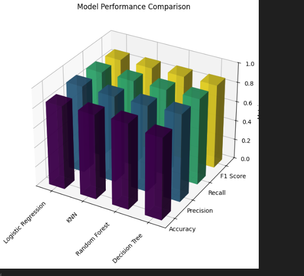

## Setting Up Python and Installing Packages
## Step 1: Install Python 3
## Step 2: Verify that you have Python 3
Open a new terminal window (CMD/Powershell, Terminal, xterm, etc), and run the following command: python3 --version
## Step 3: Create  Virtual Environment
Run the following command to create a virtual environment
python3 -m venv env
## Step 4: Activate the environment
.venv\Scripts\activate
## Step 5: Installing packages
The normal way to install a package is to run the command:
pip install <packagename>

Installing JupyterLab and Matplotlib
Run
pip install jupyterlab matplotlib
Installing other packages
Once you have activated your environment, you can install new packages in the same way you installed jupyterlab: pip install <package name>.

If you open a shell and install packages while you are running JupyterLab, you will need to restart your kernel (using the menu or the refresh button in the Notebook interface) to pick up the new packages

JupyterLab
One option (if you want to avoid using a terminal) is to open the directory where you created your virtual environment, and run jupyter-lab from either the bin or Scripts directory, depending on whether you’re on MacOS or Windows, respectively. Windows may open a web browser that says it cannot find the file; copy and paste the URLs (usually httplocalhost:8888/?token=<sometoken>) and paste it in your browser. You should be able to create shortcuts to this jupyter-lab to make it easier to find. Consult your OS and the internet on how to do this correctly.
Windows Terminal
Open your settings tab and create a new profile. Duplicate Powershell, change the name to something descriptive, and the command to %userprofile%\wmvenv\Scripts\python -m jupyterlab. Every time you open a terminal tab with this profile it will start Jupyter Lab and open a tab in a web browser.

Otherwise
Open a terminal
Activate your virtual environment
run jupyter lab
## Data-Analytics-Capstone 

## Heart Disease Prediction 
 By Habtom Woldu 
 North West Missouri State University 
 Email S565467@nwmissouri.edu, habtoma1999@gmail.com

### Abstrat 
The main focues of this study is to predict heart disease based on the clincal data set contianing patient attributes. By analyzing this data set, it can be possible to predict heart disease by developing machine learning model.

### Introduction 

Cardio vascular Disease (VDs) are a group of disorders of the heart and blood vessels. According to the WHO, Heart disease is leading causes of death worldwide, taking an estimated 17.9 million lives each year. There is a massive amount of data in the healthcare industry, and processing this amount of data is a tedious task. A computer-aided system that predicts cardiac disease can save time and money.  Those at highest risk of CVDs and ensuring they receive appropriate treatment can prevent premature deaths.

### Problem Statment 
Identifying individuals at risk of heart disease is crucial for preventing adverse outcomes and improving patient prognosis.leverage a dataset containing various patient health attributes — including age, sex, chest pain type, blood pressure, cholesterol levels, and more — to analyze and predict the likelihood of heart disease
### Goals of the Project
The objective of this project is to leverage a dataset containing various patient health attributes — including age, sex, chest pain type, blood pressure, cholesterol levels, and more — to analyze and predict the likelihood of heart disease. By using data analytics and machine learning techniques, this project will develop a predictive model capable of distinguishing between high-risk and low-risk patients

### Data Set 
This dataset, obtained from Kaggle, contains 11 commonly measured features associated with cardiovascular health and disease risk. It includes key patient health attributes such as age, sex, chest pain type, resting blood pressure, cholesterol levels, fasting blood sugar, resting electrocardiogram (ECG) results, maximum heart rate achieved, exercise-induced angina, oldpeak (ST depression induced by exercise relative to rest), and the ST slope. With around 918 observations, this dataset provides a robust foundation for the development of predictive models.
## Data Source:  https://www.kaggle.com/datasets/fedesoriano/heart-failure-prediction

## Data Description
 The heart failure prediction data set includes key patient health attributes such as age, sex, chest pain type, resting blood pressure, cholesterol levels, fasting blood sugar, resting electrocardiogram (ECG) results, maximum heart rate achieved, exercise-induced angina, old peak (ST depression induced by exercise relative to rest), and the ST slope. With around 918 observations, this dataset provides a robust foundation for the development of predictive models

## Data cleaning
 is a fundamental step before performing analysis or building machine learning models, as it ensures that the dataset is in optimal shape for drawing meaningful insights. This process typically involves cleaning, transforming, and organizing data to make it more structured and easier to work with

## Exploratory Data Analysis
Exploratory data analysis (EDA) is an essential steps in any research analysis. The primary aim of exploratory analysis is to examine the data for distribution, outliers, and anomalies to test your hypothesis directly. It also provides tools for hypothesis generation by visualizing and understanding the data usually through a graphical representation. EDA is a fundamental early step after data collection and pre-processing where the data is simply visualized, plotted, and manipulated, without any assumptions, to help assess the quality of the data and building models. “Most EDA techniques are graphical in nature with a few quantitative techniques

## Missing Values
nalyzing missing values is an important aspect of any data analysis project.  Analysis of  missing value ratio will provide information and insights on how I can rely on the feature of the data  for subsequent analysis. The below figure depict that each data feature/column with in the data has zero null values as a result handling of missing values is not necessary for the data set.

## Correlation Matrix of all features
The correlation matrix is a widely used as a non-graphical technique in Exploratory Data Analysis (EDA). It is a powerful tool for identifying patterns, trends, and dependencies among features, enabling a deeper understanding of the data \cite{website03}. Since the Heart Failure Data Set contains both numerical and categorical variables, performing a comprehensive correlation analysis requires representing all features in a numerical format to compute their correlations. Numerical variables naturally lend themselves to correlation calculations, while categorical variables must first be transformed into numerical representations. This is typically achieved through techniques such as one-hot encoding or label encoding, which convert categorical values into numerical formats while preserving the relationships between the categories. Python provides a build in function to perform the task.

## Descriptive Statistics
Descriptive statistics is a branch of statistics that involves summarizing and organizing data so it can be easily understood and interpreted. The following table shows the descriptive statistics of the numerical columns of the Heart Failure Data set.
## Pair Plot
Pair plot is also another way of displaying correlation between all variables

## Count of Heart Disease by Age and Sex
Creating a count plot of heart disease by age and sex provides valuable insights into how heart disease prevalence varies across different demographics. The following bar chart displays the prevalence of heart disease among male and female and also among different age group.

## Count of Heart Disease and  No Heart Disease
Counting patients with and without heart disease provides several critical insights that are essential for clinical decision-making. The following bar graph display the count of each target class, count with heart disease and no heart disease.

## Feature Selection
Feature selection is the most important part of the data analysis process. It deals with selecting the features used in training and making predictions. Backward elimination is used for feature selection for my dataset.
Step in backward elimination

1. Fit the full model

* Start with all independent variables in the data set

2. Compute p-value

* Check the p-value for all feature in the model.

3. Identifying the feature with the highest p-value.

* Find the feature with the largest p-value(in this case above 0.05

4. Remove the feature with the highest p-value

* if the highest p-value is exceeds the significance level, remove that feature from the model

5. Repeat the process

The backward elimination process retained all features in the dataset because none of the features had a p-value above the significance threshold (e.g., 0.05). This indicates that, statistically, all features have some degree of relationship with the target variable (Heart Disease).

## Machine Learning and Predictive Analytics 
Modeling is training an algorithm to predict the labels from features. When we train an algorithm, it becomes a model. For this project, I chose four classification algorithms to train on the training data set and compare which algorithm yields the highest accuracy. The Heart Failure Data set is split into 80\% training and 20\% testing which is further passed into different classification machine learning
#  Logestic regression
One of the machine learning algorithms I use for this project is logistic regression. Logistic regression is a flexible method for modeling and testing the relationships
between one or more quantitative and/or categorical explanatory variables and one binary (i.e., two-level) categorical outcome. The two levels of the outcome can represent anything, but generically we label one outcome “success” and the other “failure”.\cite{website03}. The outcome for the heart failure data set will be whether the patient has a heart disease or not having a heart disease.

# KNN 
The second machine learning algorithm, I use for this project is KNN because the algorithm can be used to tackle classification problems.

# Random Forest Classifer 
The third machine learning algorithm I used for this project is random forest. Random forest is a supervised algorithm that can be used for both classification and regression problem

# Decision Tree Classifer
The fourth and last supervised machine learning algorithm I employed to tackle the problem is the decision tree classifier. The model can be used for both classification and regression problem and also the model is very good for handling numerical and categorical variables.

# Model Comparing
The model was tested based on the following steps.

* First, the data set was split into training 80\% and testing 20\%.
* Then the model was trained on the training set.
* Finally, the model was tested on the testing set and evaluated how well the model performs

